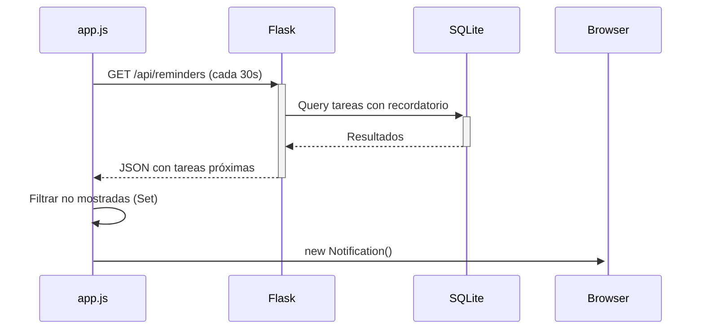

# 📋 ToDo App Web — Documentación Técnica

> **Asistente de desarrollo:** opencode (AI-powered CLI tool)
> **Repositorio:** [github.com/marco4u41/App_TO_DO_Web](https://github.com/marco4u41/App_TO_DO_Web)
> **Branch:** `master`

---

## 1. Stack Tecnológico

| Capa | Tecnología | Versión |
|------|-----------|---------|
| Backend | Python | 3.13+ |
| Framework Web | Flask | 3.1.1 |
| ORM | Flask-SQLAlchemy | 3.1.1 |
| Base de Datos | SQLite | — |
| Frontend | HTML5 + CSS3 + Vanilla JS | — |
| UI Kit | Bootstrap 5 (layout) | 5.x |
| Iconos | Bootstrap Icons | — |
| Tipografía | Inter (Google Fonts) | — |
| Herramienta IA | opencode | — |

---

## 2. Estructura del Proyecto

```
📦 todo_app/
├── 📄 AGENTS.md                        ← Documentación del proyecto
├── 📄 app.py                           ← Punto de entrada / factory pattern
├── 📄 config.py                        ← Configuración centralizada
├── 📄 README.md                        ← Instructivo de uso
├── 📄 requirements.txt                 ← Dependencias Python
│
├── 📁 database/                        ← Base de datos SQLite (auto-creada)
│
├── 📁 models/
│   ├── 📄 __init__.py
│   └── 📄 task.py                      ← Modelo Task (ORM) + constantes
│
├── 📁 routes/
│   ├── 📄 __init__.py
│   └── 📄 routes.py                    ← Blueprint con 11 endpoints REST
│
├── 📁 utils/
│   ├── 📄 __init__.py
│   └── 📄 validators.py                ← Validación de datos de entrada
│
├── 📁 static/
│   ├── 📁 css/
│   │   └── 📄 style.css                ← 100% de los estilos (dark/light mode)
│   ├── 📁 images/                      ← Favicon / iconos (opcional)
│   └── 📁 js/
│       └── 📄 app.js                   ← Toda la lógica frontend (Fetch API)
│
└── 📁 templates/
    ├── 📄 base.html                    ← Layout base (sidebar, navbar, toasts)
    └── 📄 index.html                   ← Página principal (tablero + modal CRUD)
```

---

## 3. Modelo de Datos — `Task`

| Campo | Tipo | Restricciones | Descripción |
|-------|------|---------------|-------------|
| `id` | `Integer` | PK, autoincrement | Identificador único |
| `title` | `String(200)` | NOT NULL | Título de la tarea |
| `description` | `Text` | Default `''` | Descripción opcional |
| `priority` | `String(10)` | Default `'media'` | `alta`, `media`, `baja` |
| `category` | `String(50)` | Default `'personal'` | `trabajo`, `universidad`, `personal`, `compras`, `salud`, `otras` |
| `due_date` | `DateTime` | Nullable | Fecha y hora de vencimiento |
| `completed` | `Boolean` | Default `False` | Estado de completado |
| `created_at` | `DateTime` | Default `utcnow` | Marca de creación |
| `reminder_minutes` | `Integer` | Nullable | Minutos antes para recordatorio |

**Valores válidos para `reminder_minutes`:**
| Valor | Significado |
|-------|-------------|
| `None` | Sin recordatorio |
| `0` | En el momento exacto |
| `5` | 5 minutos antes |
| `15` | 15 minutos antes |
| `30` | 30 minutos antes |
| `60` | 1 hora antes |
| `1440` | 1 día antes |

---

## 4. API REST — Endpoints

### 4.1 HTML

| Método | Ruta | Función | Descripción |
|--------|------|---------|-------------|
| GET | `/` | `index()` | Renderiza la SPA con Jinja2 |

### 4.2 CRUD de Tareas

| Método | Ruta | Función | Request Body | Response | Códigos |
|--------|------|---------|-------------|----------|---------|
| GET | `/api/tasks` | `get_tasks()` | — | `[{task}, ...]` | 200 |
| POST | `/api/tasks` | `create_task()` | `{title, description, priority, category, due_date, reminder_minutes}` | `{success, task}` | 201 / 400 |
| GET | `/api/tasks/<id>` | `get_task(id)` | — | `{task}` | 200 / 404 |
| PUT | `/api/tasks/<id>` | `update_task(id)` | `{title, description, priority, category, due_date, reminder_minutes}` | `{success, task}` | 200 / 400 / 404 |
| PATCH | `/api/tasks/<id>/toggle` | `toggle_task(id)` | — | `{success, task}` | 200 / 404 |
| DELETE | `/api/tasks/<id>` | `delete_task(id)` | — | `{success}` | 200 / 404 |

### 4.3 Utilidades

| Método | Ruta | Parámetros | Descripción |
|--------|------|-------------|-------------|
| GET | `/api/stats` | — | Estadísticas: `total`, `completed`, `pending`, `overdue`, `due_today` |
| GET | `/api/search` | `?q=texto` | Búsqueda textual en título y descripción (ILIKE) |
| GET | `/api/filter` | `?status=&priority=&category=&sort=` | Filtros combinados con ordenamiento |
| GET | `/api/reminders` | — | Tareas con recordatorio activo en ventana de 60s |

### 4.4 Parámetros de `/api/filter`

| Parámetro | Valores | Default |
|-----------|---------|---------|
| `status` | `pending`, `completed`, `''` | `''` (todos) |
| `priority` | `alta`, `media`, `baja`, `''` | `''` (todas) |
| `category` | `trabajo`, `universidad`, `personal`, `compras`, `salud`, `otras`, `''` | `''` (todas) |
| `sort` | `created_at`, `priority`, `due_date`, `alphabetical` | `created_at` |

---

## 5. Arquitectura Frontend

### 5.1 Flujo de Datos

```
Usuario → Interfaz (eventos DOM) → app.js (Fetch API) → Flask REST → SQLAlchemy → SQLite
                                                                 ↓
Usuario ← DOM actualizado    ← app.js (render)          ← JSON response
```

### 5.2 Funcionalidades Clave

- **CRUD sin recarga:** Todo via `fetch()` con modales Bootstrap dinámicos
- **Dashboard en vivo:** Estadísticas actualizadas al crear/editar/eliminar tareas
- **Progress Bar:** Progreso de completado en tiempo real
- **Filtros combinados:** Estado + prioridad + categoría + orden en un solo request
- **Búsqueda instantánea:** Ctrl+K abre buscador, filtra mientras escribes
- **Recordatorios inteligentes:** Polling cada 30s, notificaciones nativas del navegador, deduplicación vía `Set`
- **Urgencia visual:** Colores en bordes según cercanía del vencimiento:
  - 🔴 `--color-urgent` (vencido)
  - 🟠 `due-soon` (< 1 hora)
  - 🟡 `due-approaching` (< 24 horas)
- **Modo oscuro/claro:** Detecta preferencia del sistema, persiste en localStorage
- **Atajos de teclado:**
  - `Ctrl+K` / `Cmd+K` → Buscar
  - `N` → Nueva tarea
- **Responsive:** Adaptable a móvil, tablet y escritorio

### 5.3 Sistema de Notificaciones



---

## 6. Validaciones (`utils/validators.py`)

| Campo | Regla |
|-------|-------|
| `title` | Obligatorio, máx. 200 caracteres |
| `description` | Opcional, se trimmea |
| `priority` | Debe ser `alta`, `media` o `baja` |
| `category` | Debe estar en lista predefinida |
| `due_date` | Formato `YYYY-MM-DD` o `YYYY-MM-DDTHH:MM` |
| `reminder_minutes` | Debe ser `None`, `0`, `5`, `15`, `30`, `60` o `1440` |

**Protección adicional en backend:** Duplicados — no permite crear/editar tareas con el mismo título que otra pendiente.

---

## 7. Configuración (`config.py`)

```python
SECRET_KEY = '...'
SQLALCHEMY_DATABASE_URI = 'sqlite:///database/database.db'
SQLALCHEMY_TRACK_MODIFICATIONS = False
```

La base de datos se crea automáticamente al iniciar la app mediante `db.create_all()` dentro del Application Factory Pattern.

---

## 8. Ejecución

```bash
# Instalar dependencias
pip install -r requirements.txt

# Iniciar servidor
python app.py

# El servidor corre en:
#   http://localhost:5000
#   http://192.168.x.x:5000  (red local)
```

Modo desarrollo con `debug=True`, autorecarga al detectar cambios.

---

## 9. Desarrollo con opencode

Este proyecto fue desarrollado íntegramente con **opencode** como asistente de inteligencia artificial, utilizando:

- **Planificación guiada:** La sesión comenzó con objetivos claros y un checklist (`todowrite`)
- **Scaffolding automatizado:** Generación de estructura de archivos, modelos, rutas, templates
- **Debugging asistido:** Corrección de errores comunes (`$` vs `$$`, `nullslast`, imports redundantes)
- **Refinamiento iterativo:** Desde CRUD básico hasta recordatorios con notificaciones nativas
- **Control de versiones:** Push a GitHub completado (`54fe232`)

### Comandos útiles durante la sesión

```bash
# Ver estado del proyecto
Get-ChildItem -Recurse -File | Select-Object FullName

# Ver estructura
cmd /c "tree /F /A"

# Ver cambios recientes
git log --oneline -5

# Iniciar servidor
python app.py
```

---

## 10. Roadmap / Próximos Pasos

| Feature | Estado |
|---------|--------|
| CRUD completo | ✅ |
| Filtros y búsqueda | ✅ |
| Modo oscuro | ✅ |
| Recordatorios + notificaciones | ✅ |
| Urgencia visual por colores | ✅ |
| Dashboard con estadísticas | ✅ |
| Atajos de teclado | ✅ |
| Responsive design | ✅ |
| Carga de icono en notificaciones (`/static/images/icon.png`) | ⬜ Pendiente |
| Tests automatizados | ⬜ Pendiente |
| Dockerización | ⬜ Pendiente |
| Despliegue en producción | ⬜ Pendiente |

---

> **Documentación generada el:** Julio 2026  
> **Herramienta:** opencode — [https://opencode.ai](https://opencode.ai)
